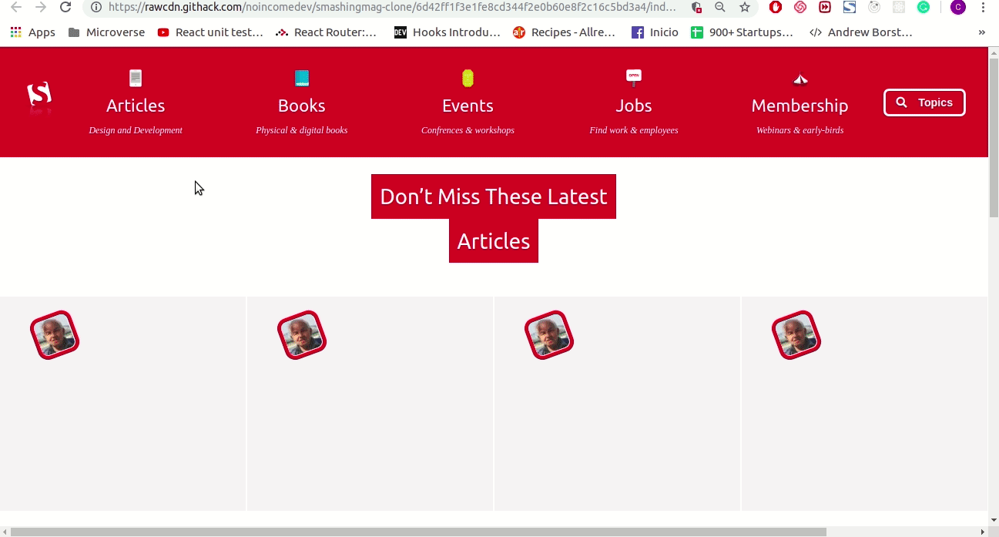

# SMASHING MAGAZINE Clone

> Project taked from HTML/CSS Microverse Curriculum

### HTML & CSS Course

Simple SMASHING MAGAZINE clone made with HMTL and CSS (Flexbox) to demostrate mastery using CSS propertyes and mockup skills.

## Built With HTML,CSS,FlexBox

- Fonts
- Queries
- Information Hierachy
- Grids

## Live Demo

[**Live Demo Link**](https://rawcdn.githack.com/noincomedev/smashingmag-clone/6d42ff1f3e1fe8cd344f2e0b60e8f2c16c5bd3a4/index.html)

## Getting Started

To start to using this project you will need to clone or download tis repository to your localhost and open on your server the index.html file.

### Deployment

This basicaly only a web page with only one HTML file you will only need to open on your browser the index.html file.

## Authors

👤 **Cristian Ines Hernandez A. - MephistoDevelop**

- Github: [@MephistoDevelop](https://github.com/MephistoDevelop)
- Twitter: [@MephistoDevelop](https://twitter.com/MephistoDevelop)
- Linkedin: [Cristian Hernandez](https://www.linkedin.com/in/cristian-hernandez1992/)

👤 **Diego Roblez Vergara. - NOINCOMEDEV**

- Github: [@noincomedev](https://www.github.com/noincomedev)/cristian-hernandez1992/)

## 🤝 Contributing

Contributions, issues and feature requests are welcome!

Feel free to check the [issues page](issues/).

## Show your support

Give a ⭐️ if you like this project!

## 📝 License

This project is [MIT](lic.url) licensed.
